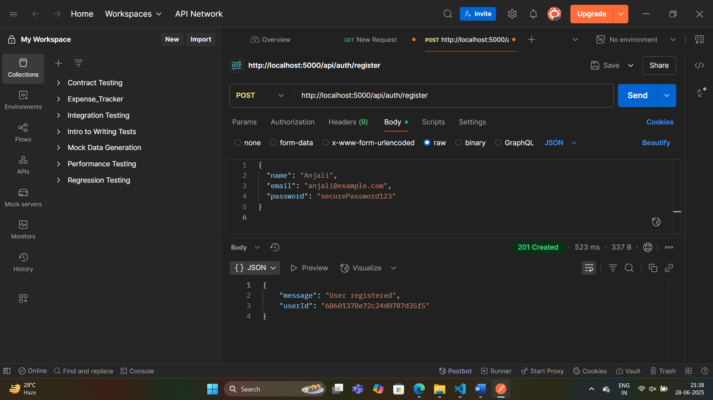
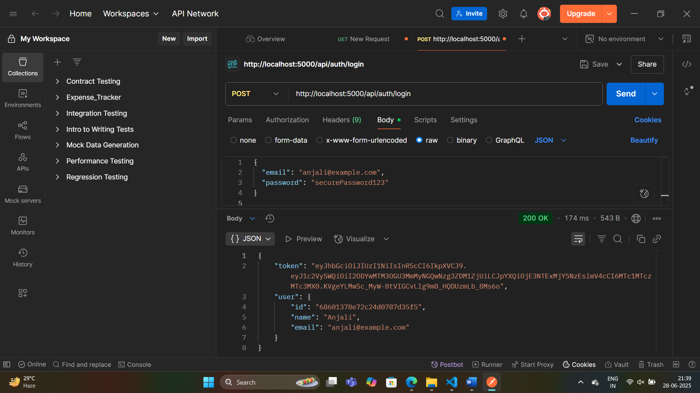

# 🛠️ DocSign Backend

This is the **Express + MongoDB** backend for the DocSign digital signature application. It handles user authentication and will support PDF upload, signing, audit logging, and sharing.

## 🔧 Tech Stack

- Node.js
- Express.js
- MongoDB + Mongoose
- JSON Web Token (JWT)
- bcryptjs
- dotenv
- Multer (PDF upload – upcoming)
- PDF-Lib (PDF signing – upcoming)

## ✅ Completed Features (as of Day 2)

- [x] Express server setup
- [x] MongoDB connection via Mongoose
- [x] User schema with `name`, `email`, `password`
- [x] `/api/auth/register` and `/api/auth/login` routes
- [x] JWT-based authentication
- [x] Auth middleware for protected routes

---

## 🖼️ API Screenshots

### 🔐 Register API (POST `/api/auth/register`)

---

### 🔐 Login API (POST `/api/auth/login`)

---

## 🧪 Environment Variables

Create a `.env` file:

